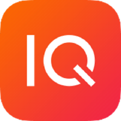

# AxonIQ中文文档 <small>4.4</small>

> 用于事件驱动微服务的Axon Framework和Axon Server

- 开源的Axon Framework提供了一个干净，优雅的Java API，用于编写DDD，CQRS和事件源应用程序。
- Axon Server 免费版旨在满足Axon应用程序的所有基础结构需求。
- Axon Server 企业版提供了高级支持选项，多上下文以及多个节点的集群。

[GitHub](https://github.com/Valdanitooooo/axoniq-zh)
[Getting Started](4.4/getting-started/quick-start)
